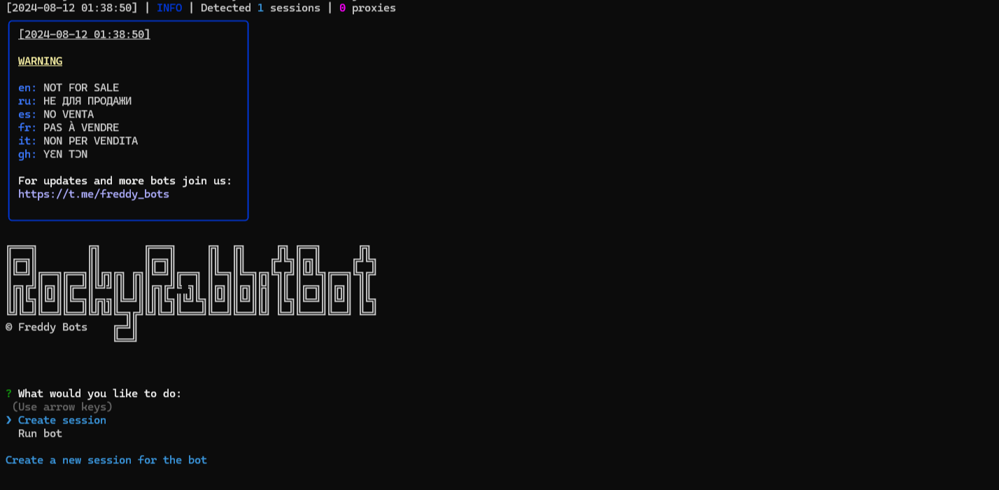

> [](https://t.me/roddyfred)



# Use Node.Js 18 or greater

## Functionality

| Functional                            | Supported |
| ------------------------------------- | :-------: |
| Claiming of daily combo               |    ✅     |
| Claiming of daily enigma              |    ✅     |
| Claiming of daily easter eggs         |    ✅     |
| Claiming daily rewards                |    ✅     |
| Completing tasks                      |    ✅     |
| Applying boosts                       |    ✅     |
| Upgrading taps                        |    ✅     |
| Upgrading hourly limit                |    ✅     |
| Upgrading energy limit                |    ✅     |
| Upgrading cards limit                 |    ✅     |
| Tapping                               |    ✅     |
| Data caching                          |    ✅     |
| Multithreading                        |    ✅     |
| Use sessions/query_ids                |    ✅     |
| Binding a proxy to a session/query_id |    ✅     |
| Random sleep time between clicks      |    ✅     |
| Random number of taps                 |    ✅     |

## [How to add query id](https://github.com/Freddywhest/RockyRabbitBot/blob/main/AddQueryId.md)

## [Settings](https://github.com/FreddyWhest/RockyRabbitBot/blob/main/.env-example)

| Settings                      | Description                                                               |
| ----------------------------- | ------------------------------------------------------------------------- |
| **API_ID / API_HASH**         | Platform data from which to launch a Telegram session (stock - Android)   |
| **AUTO_PLAY_ENIGMA**          | Whether to apply daily enigma (True / False)                              |
| **AUTO_PLAY_COMBO**           | Whether to apply daily combo (True / False)                               |
| **AUTO_COMPLETE_TASKS**       | Whether to complete tasks (True / False)                                  |
| **AUTO_UPGRADE_CARD**         | Whether to upgrade cards to increase the passive earn (True / False)      |
| **MAX_CARD_LEVEL**            | Maximum cards level (eg 20)                                               |
| **MAX_CARD_PRICE**            | Maximum cards upgrade price (eg 50000000)                                 |
| **AUTO_UPGRADE_TAP**          | Whether to upgrade taps (True / False)                                    |
| **MAX_TAP_LEVEL**             | Maximum tap level (eg 20)                                                 |
| **AUTO_HOURLY_LIMIT**         | Whether to upgrade hourly limit (True / False)                            |
| **MAX_HOURLY_LIMIT_LEVEL**    | Maximum hourly limit level                                                |
| **AUTO_UPGRADE_ENERGY_LIMIT** | Whether to upgrade energy limit (True / False)                            |
| **MAX_ENERGY_LIMIT_LEVEL**    | Maximum energy limit level (eg 20)                                        |
| **APPLY_DAILY_FULL_ENERGY**   | Whether to apply daily full energy (True / False)                         |
| **AUTO_CLAIM_REWARD**         | Whether to claim the daily rewards (True / False)                         |
| **AUTO_CLAIM_EASTER_EGG**     | Whether to claim the easter eggs (True / False)                           |
| **USE_QUERY_ID**              | Whether to use query ids instead of sessions (True / False)               |
| **RANDOM_TAPS_COUNT**         | Random number of taps (eg [100,200])                                      |
| **SLEEP_BETWEEN_TAP**         | Random delay between taps in seconds (eg [50,60])                         |
| **SLEEP_EMPTY_ENERGY**        | Delay when energy is empty (eg 70)                                        |
| **USE_PROXY_FROM_FILE**       | Whether to use proxy from the `bot/config/proxies.js` file (True / False) |

## Installation

You can download [**Repository**](https://github.com/FreddyWhest/RockyRabbitBot) by cloning it to your system and installing the necessary dependencies:

```shell
~ >>> git clone https://github.com/FreddyWhest/RockyRabbitBot.git
~ >>> cd RockyRabbitBot

#Linux and MocOS
~/RockyRabbitBot >>> chmod +x check_node.sh
~/RockyRabbitBot >>> ./check_node.sh

OR

~/RockyRabbitBot >>> npm install
~/RockyRabbitBot >>> cp .env-example .env
~/RockyRabbitBot >>> nano .env # Here you must specify your API_ID and API_HASH , the rest is taken by default
~/RockyRabbitBot >>> node index.js

#Windows
1. Double click on INSTALL.bat in RockyRabbitBot directory to install the dependencies
2. Double click on START.bat in RockyRabbitBot directory to start the bot

OR

~/RockyRabbitBot >>> npm install
~/RockyRabbitBot >>> cp .env-example .env
~/RockyRabbitBot >>> # Specify your API_ID and API_HASH, the rest is taken by default
~/RockyRabbitBot >>> node index.js
```

Also for quick launch you can use arguments, for example:

```shell
~/RockyRabbitBot >>> node index.js --action=1

OR

~/RockyRabbitBot >>> node index.js --action=2

#1 - Create session
#2 - Run clicker
```
